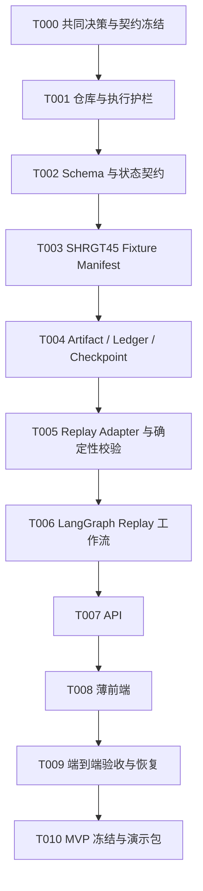

# AI Scientist MVP 任务队列

> 工作项状态：`IMPLEMENTED_PENDING_CLOSEOUT`
>
> 当前入口：`tasks/TASK-006.md`
>
> 原则：下面是依赖顺序，不代表允许一次把所有任务交给 Agent 连续修改。每一项冻结成独立任务卡后再执行。

项目所有者已确认 `D-001=A` 至 `D-008=A`。T000 至 T005 均已完成并登记完成记录；T006 首次构建已完成并通过主审回归，但尚未创建 T006 CompletionRecord 或执行正式 closeout。后续仍必须一次只执行一张任务卡。

## 依赖图



## T000：共同决策与契约冻结

目标：登记已确认的 D-001 至 D-008，冻结章程、契约、Workflow、ResearchQuestion、Finding 路由和任务执行边界。

输出：

- `PROJECT_CHARTER.md = ACCEPTED`；
- `CONTRACTS.md = ACCEPTED`；
- 所有已接受治理决策的内容寻址 DecisionRecord；
- `governance/baseline.lock.json`，绑定冻结章程、契约、DecisionRecord、ResearchQuestion 和 Workflow 的版本/哈希；
- `docs/adr/ADR-001-mvp-architecture.md`，记录 LangGraph、Provider、Artifact/Store、API 和前端边界；
- 待实现的 JSON Schema 清单；
- 首个 Case 的逻辑资产清单；
- 已批准的聚合 `RunReadModel`、详情引用边界和最小前端字段；
- 哪些已登记 Finding 可在精确哈希审批后回放、哪些错误必须 Fail Closed；
- 契约冻结后生成项目根目录正式 `AGENTS.md` 和 `tasks/TASK-001.md`，作为进入 T001 的启动闸门。

验收：D-001 至 D-008 均有内容寻址 DecisionRecord；正式文件由 `baseline.lock.json` 绑定；所有待实现任务都能引用明确的契约版本。

当前工作项状态：`COMPLETED`；完成时间：2026-08-19；下一工作项：`tasks/TASK-001.md`。

## T001：仓库与执行护栏

状态：`COMPLETED`。完成记录：`governance/completions/TASK-001.completion.json`。执行入口以根目录 `tasks/TASK-001.md` 为准，本节仅保留队列摘要。

目标：建立最小、可测试的项目骨架，不写业务流程。

输出：

- Git 仓库与忽略规则；
- Python 项目骨架和测试入口；
- 前后端目录边界；
- 校验 T000 已生成的根目录 `AGENTS.md` 与 `TASK-001`，并把它们纳入仓库；
- `docs/`、`contracts/`、`fixtures/`、`tasks/`、`src/`、`tests/`；
- 无密钥的 `.env.example`；
- 基础 CI 或本地统一校验命令。

验收：空项目测试可重复运行；无网络和无 API Key 时仍能完成基础检查。

## T002：Schema 与状态契约

状态：`COMPLETED`。完成记录：`governance/completions/TASK-002.completion.json`。执行入口以根目录 `tasks/TASK-002.md` 为准，本节仅保留队列摘要。

目标：把已冻结的语义契约机械化。

输出：

- ResearchQuestion、RunConfigurationSnapshot、ReplayCaseManifest、SourceAssetRef；
- ArtifactEnvelope、不可变 ArtifactRef、`IMPORTED SourceDocument / DERIVED Snapshot / NATIVE Artifact` 三类权威语义、RunRecord/StageRun；
- ValidationReport、CompatibilityFinding、GapFinding、FindingDisposition、FailureRecord；
- DecisionRequest/DecisionOption、DecisionRecord、AuthorizationRecord；
- 正交状态枚举和作为机器规范源的 JSON Schema；
- 由 Schema 生成或通过一致性测试约束的 Python 类型；
- 合法/非法 Golden Contract Fixture。

验收：契约测试证明状态不能混用；V2.2 不能静默冒充 V2.3；内容变更必须生成新 Artifact 实例，绑定旧哈希的决定继续作为旧链审计记录但不适用于新实例。

## T003：SHRGT45 Fixture Manifest

状态：`COMPLETED`。完成记录：`governance/completions/TASK-003.completion.json`。执行入口以根目录 `tasks/TASK-003.md` 为准，本节仅保留队列摘要。

目标：按 D-003 策略和 D-005 批准白名单导入或引用精选历史资产，并对缺失项和已知边界做显式登记。

输出：

- `fixtures/shrgt45/case-manifest.*`；
- 逻辑资产 ID、相对路径、原来源、版本、日期、字节数和 SHA256；
- Included/Excluded 清单；
- S04 的两个独立 `SourcePackageRef`：0808 完整权威来源包与 0814 Demo 运行投影；
- 0808 的 90 成员、0814 的 43 成员、37 条已核对 `DERIVED_FROM` 血缘及两个导入审计 tree hash；
- 已知缺口；
- Manifest 中的 S01 专家预选种子 Gap 声明（运行时 Finding 由后续 Adapter/Graph 生成）；
- `S04_0808_PACKAGE_INTEGRITY_REFERENCES_MISSING_FROM_TRANSFER` 声明；
- 导入审计报告；
- D-005 批准清单的逐文件机械化；此时不生成跨接缝批准，因为下游 Artifact 与 Finding 尚不存在。

验收：总范围为 171 文件、9,725,849 B；哈希变化或必需资产缺失时 Fail Closed；默认运行输入只包含 0814，0808 仅用于 provenance/审计；不执行其中脚本或解压 ZIP；不读取 `.env`，不复制 `.venv`，不修改 `D:\桌面\揭榜-移交版` 源资料。

## T004：Artifact、Ledger 与 Checkpoint

状态：`COMPLETED`。完成记录：`governance/completions/TASK-004.completion.json`。实现与修正已由主 Agent 审查并完成，执行入口卡和修正卡保留为历史证据。

目标：在已知真实 Fixture 形态的前提下建立通用可追溯运行内核，但不让内核依赖任何历史业务格式。

输出：

- ArtifactStore；
- canonical JSON 与 SHA256；
- 追加式 Ledger；
- Run/StageRun 持久化；
- Checkpoint；
- 运行目录隔离和幂等写入。

验收：同一输入重放不产生冲突副作用；Artifact ID 永远对应唯一内容哈希；冻结 Artifact 不可覆盖；恢复后父子血缘和哈希保持一致。

## T005：Replay Adapter 与确定性校验

状态：`COMPLETED`。完成记录：`governance/completions/TASK-005.completion.json`。首次构建和主 Agent 修正均已完成；任务卡保留为历史证据。

目标：隔离 S01 和流程 2–6 的历史格式，转换为公共 Envelope 和最小领域摘要，并提供 S07 开发性报告 Renderer。

输出：

- ReplayCandidateProvider、Mechanism、Hypothesis、Data、Counterexample、Magnetogram QA Replay Provider；
- 生成系统原生 ResearchSummary 的 ReportRenderer；
- 保留流程 3 现有 27 个测试以证明 Validator 代码本身可用，但不对缺少机器五件套的历史 Hypothesis 反推补造输入或声称已通过该 Validator；
- 契约预置的全部 CompatibilityFinding 和 GapFinding；
- 能生成 `FIXTURE_IMPORT_REVIEW` DecisionRequest 的逻辑，Request 必须包含实际 ArtifactRef、Finding 和精确哈希；
- 适配器扫描和验证报告。

验收：历史载荷变化不会要求修改主图；结构 PASS 不改变科学结论；已登记接缝只有绑定精确哈希的 `FIXTURE_IMPORT_REVIEW` 批准后才能继续 Replay；未知哈希、Schema 或来源错误仍 Fail Closed。

## T006：LangGraph Replay 工作流

状态：`IMPLEMENTED_PENDING_CLOSEOUT`。执行入口仍以根目录 `tasks/TASK-006.md` 为准；首次构建、主审修正和回归已完成，`T006 CompletionRecord` 尚未创建。执行同事只负责首次构建，主 Agent 负责后续审查和修正。

目标：实现只依赖 Provider 接口和 Artifact 引用的顶层图。

输出：

- Graph State；
- S01–S07 节点与路由；
- S04 后 S05/S06 并列、S07 汇合；
- `FIXTURE_IMPORT_REVIEW` 人工中断点：本次 Run 生成实际 Artifact/Finding 后进入 `WAITING_HUMAN`，收到绑定精确哈希的 DecisionRecord 才恢复；
- `FINAL_REPLAY_REVIEW` 非阻塞项目报告查看确认：绑定不可变 Report ArtifactRef 并追加审阅记录，但不暂停报告可见性、不产生 ReleaseDisposition；
- 错误路由、有限重试和恢复。

验收：路由测试证明 05/06 并列；节点幂等；Graph State 不含长文和大对象；`NOT_AUTHORIZED` 正式执行路径被拒绝。当前回归证据：T006 专项 25 passed，全量 217 passed，冻结审计 131 passed。

## T007：API

目标：为前端提供稳定、只围绕公共契约的 API，并实现 D-006 批准的聚合 `RunReadModel`。

输出：

- 创建/启动/恢复 Replay Run；
- Run 和 Stage 状态查询；
- Artifact、来源和血缘查询；
- Validation/Compatibility/Failure 查询；
- Replay 人工决策提交；
- Report 查询。
- `GET /runs/{run_id}/read-model` 聚合查询；原始 Artifact、Finding、Lineage、Source 和 Report 通过引用式详情查询访问。

验收：API 不泄露机器绝对路径或密钥；错误响应保留失败类别；无法通过 API 绕过授权和 Artifact 不可变规则。

## T008：完整薄前端

目标：消费 D-006 批准的聚合 `RunReadModel`，把系统真实状态完整显示出来，不在前端复制研究逻辑。

输出：

- 单个 Task/Run 概览；
- 流程阶段和 05/06 并列关系；
- S01 `EXPERT_SEED / NOT_IMPLEMENTED` 状态；
- Artifact 详情、来源、父子血缘和版本；
- Validation、Compatibility、Failure 独立显示；
- 人工审核界面；
- 最终开发性报告视图；
- 只读研究证据视图：门控漏斗/计数、现有 SHRGT45 时间序列或分布、USFLUX 背景关系和固定磁图 QA 面板；
- 加载、空、失败、等待人工和恢复状态。

验收：前端不把 PASS 显示成“科学支持”；不把 55 行显示成 55 个独立样本；所有关键限制在相应结果附近可见；桌面与移动视口无文本溢出或状态遮挡。

## T009：端到端验收与恢复

目标：证明离线 Replay 是一个可重复系统，而不是一组页面截图。

输出：

- 无网络/无 API Key 的端到端测试；
- 中断与恢复测试；
- 哈希篡改测试；
- 授权拒绝测试；
- Golden Summary；
- 真实浏览器端到端测试、API 失败态、桌面/移动截图和文本溢出检查。

Golden Summary 至少核对：6、360、333、55=37+18、4 个活动区，以及全部科学限制。

## T010：MVP 冻结与演示包

目标：形成可移交、可演示、可继续扩展的 `v0.1.0`。

输出：

- 本地启动说明；
- 一条标准 Replay 命令；
- 架构和数据血缘说明；
- 测试证据；
- 已知限制；
- 非阻塞项目报告查看确认 `FINAL_REPLAY_REVIEW`；
- 下一阶段的 Active Slice 任务卡。

验收：新环境按文档可启动；所有契约版本和 Fixture 哈希可追溯；报告保持 `NOT_EVALUATED / DEVELOPMENTAL`；没有专家审核记录时不能标记为可对外或比赛发布。

## MVP 之后，不混入上述任务

```text
A001  MechanismBrief V2.3 -> canonical extract
A002  QwenHypothesisProvider + 离线 Fake Provider
A003  新 Hypothesis DRAFT -> Validator -> 人工冻结
A004  流程 2 DeepResearchMechanismProvider
A005  JsocDataProvider / CompetitionDataProvider
A006  经授权的统计执行与正式 VerificationResult
A007  新参数与多 StudyRun 泛化
```

这些任务只有在 Replay MVP 验收后才进入队列。它们替换或增加 Provider，不重写公共 Artifact、Run 和状态语义。
