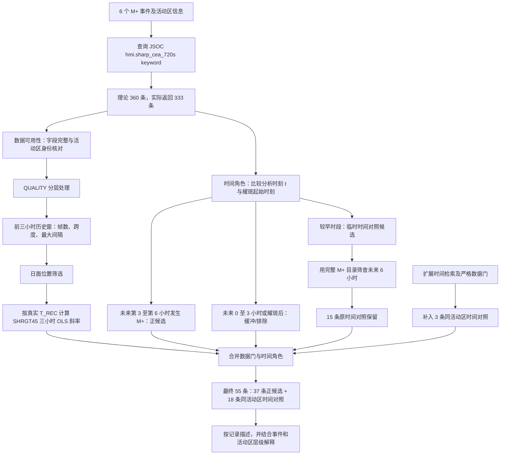

# SHRGT45 Demo 数据处理流程与规则说明

## 当前实现、使用边界与跨参数迁移

## 1. 研究问题与数据处理对象

本次 Demo 研究的是活动区磁场参数在耀斑前的短时变化。对每一个候选分析时刻 (t)，先使用该时刻及其之前 3 小时的观测计算 SHRGT45 的变化，再判断同一活动区在 (t) 之后第 3 至第 6 小时是否发生 M 级及以上耀斑。当前采用的主要变化量是 SHRGT45 对真实观测时间的三小时普通最小二乘线性斜率。

## 2. SHRGT45 相关术语

| 术语 | 本文中的含义 | 在当前流程中的作用 |
|---|---|---|
| SHARP keyword 记录 | 某一观测时刻的活动区官方汇总字段 | 构成时间序列的基本数据行 |
| 候选分析时刻 (t) | 当前记录的 `T_REC`，也是历史窗终点 | 决定向前取数和向后判断事件的时间锚点 |
| T_flare | 目标 M+ 耀斑的 GOES 起始时刻 | 划分事件前正候选、缓冲记录和其他时段 |
| HARPNUM / NOAA_AR | HMI 活动区补丁编号 / NOAA 活动区编号 | 核对磁场记录与目标事件是否属于同一活动区 |
| QUALITY | 逐时刻数据产品的位掩码质量状态 | 决定记录排除、保留或进入严格敏感性检查 |
| CMASK | 官方参数计算中参与计算的有效像素数 | 是 SHRGT45 的分母诊断量，本轮未取回 |
| 同活动区时间对照 | 同一活动区的较早时段，未来 6 小时经目录筛查无 M+ | 展示同一区域的时间背景，不等于独立阴性活动区 |
| 统计单位 | 可以视作独立证据的事件或活动区 | 防止把重叠的 12 分钟记录误当成独立样本 |

## 3. 当前实际运行的数据处理流程

当前处理由两条逻辑共同决定最终样本。

- 一条是**数据可用性逻辑**，检查活动区归属、字段、质量、历史窗和位置；
- 另一条是**时间角色逻辑**，根据候选分析时刻与耀斑时间的关系确定正候选、缓冲记录或时间对照。

只有同时满足相应数据门和时间角色条件的记录，才进入最终结果。

### 3.1 缺帧保留

所有缺失时刻均按真实缺帧保留，没有用插值生成 SHRGT45，也没有把缺口两侧的观测强行压成连续时间。

本次要求每条记录具备 `SHRGT45`、`MEANALP`、`USFLUX`、`QUALITY`、`LON_FWT` 和 `LAT_FWT` 等字段。333 条返回记录在这些字段上均完整。

### 3.2 活动区身份核对

事件种子同时给出 NOAA 活动区编号和 HARP 编号。对每条返回记录，当前实现检查返回的 `NOAA_AR` 是否等于或包含目标事件的 NOAA 活动区编号；符合时认为活动区映射通过，不符合时阻断该记录，留待检查多活动区 HARP 或标签归属问题。

该规则的目的，是防止把同一个 HARP 中属于其他 NOAA 活动区的磁场记录误配给目标耀斑。

### 3.3 `QUALITY` 的主规则和严格敏感性规则

| 质量状态                                 | 本次 Demo 的处理                                             | 说明                                               |
| ---------------------------------------- | ------------------------------------------------------------ | -------------------------------------------------- |
| 含 `0x80000000`、`0x40000000` 或二者组合 | 作为致命质量状态，该帧不计入有效历史帧                       | 这是本次程序采用的排除规则                         |
| 其他非零 `QUALITY`                       | 暂时保留，同时记录原始十六进制值                             | 非零不自动等于数据不可用，是否应进一步排除仍需判断 |
| `QUALITY=0`                              | 正常保留                                                     | 表示未出现已编码的质量异常                         |
| 严格敏感性规则                           | 三小时窗须满足 16/16 帧、字段完整、活动区映射通过且所有帧均为 `QUALITY=0` | 用于检查主结果是否依赖较宽松的质量规则             |

下面是本轮实际出现的非零值：

| `QUALITY` 值 | 官方含义简述                                  | 本次处理       |
| ------------ | --------------------------------------------- | -------------- |
| `0x00000400` | 宇宙线命中表不可读                            | 暂时保留并留痕 |
| `0x00001000` | 未正确完成 gap-fill（缺口填补）               | 暂时保留并留痕 |
| `0x00010000` | 平均插值点数不足或插值间隔过大                | 暂时保留并留痕 |
| `0x00010400` | `0x00010000` 与 `0x00000400` 两种状态同时出现 | 暂时保留并留痕 |

### 3.4 三小时历史窗、缺帧和连续性

对每一个候选分析时刻 (t)，历史窗为从 (t-3) 小时到 (t) 的 16 个理论时刻，包含起点和终点。理论帧数为 16，是因为 180 分钟按 12 分钟间隔形成 15 个间隔和 16 个时刻。

| 历史窗条件   | 当前规则        | 作用                             |
| ------------ | --------------- | -------------------------------- |
| 有效帧数     | 不少于 14/16 帧 | 避免由过少观测点决定趋势         |
| 实际覆盖跨度 | 不少于 160 分钟 | 避免有效帧集中在三小时窗的一小段 |
| 最大相邻间隔 | 不超过 24 分钟  | 避免历史窗中出现较长的连续缺测   |

### 3.5 日面位置筛选

进一步要求候选分析时刻 (t) 的 `abs(LON_FWT)<50°` 且 `abs(LAT_FWT)<50°`。

目的，是减少活动区接近日面边缘时横向磁场误差、投影效应和消歧不确定性对参数的影响。

### 3.6 三小时 SHRGT45 变化的计算

对通过历史窗规则的记录，本次使用有效帧的真实 `T_REC` 作为横轴，以 SHRGT45 百分比作为纵轴，计算普通最小二乘斜率。主结果单位为“百分点/小时”。缺帧不会被当作连续的第 1、2、3 个等间隔样本，而是按实际经过的分钟数进入拟合。

OLS 斜率把三小时序列压缩成一个平均线性方向：正值表示总体上升，负值表示总体下降。

当前主要比较使用 OLS 斜率。三小时长度、线性斜率及预期正向变化

### 3.7 事件前候选、缓冲记录和时间对照

对每一个候选分析时刻 (t)，当前实现先计算其距离输入的目标事件起始时刻的时间。

| 与种子事件的时间关系                     | 状态         | 是否进入主比较 |
| ---------------------------------------- | ------------ | -------------- |
| 事件在未来大于 3 小时且不超过 6 小时发生 | 事件前正候选 | 是             |
| 事件在未来 0 至 3 小时发生               | 近时窗缓冲   | 否             |
| 事件已经开始                             | 事件后记录   | 否             |

## 4. 上述规则对最终样本的影响

### 4.1 主查询与最终样本构成

| 处理环节 | 记录数 | 含义 |
|---|---:|---|
| 理论查询 | 360 | 6 个事件，每个事件理论 60 个时刻 |
| JSOC 实际返回 | 333 | 缺少 27 个理论时刻，不插值 |
| 主字段完整 | 333 | 仅说明所需 keyword 存在 |
| 活动区映射通过 | 273 | 返回 NOAA 活动区与目标事件一致或包含目标活动区 |
| 三小时历史窗通过 | 178 | 同时满足 14/16、160 分钟和 24 分钟规则 |
| 当前位置门通过 | 132 | 历史窗通过且候选时刻经纬度绝对值均小于 50° |
| 最终事件前正候选 | 37 | 通过数据门且未来第 3 至第 6 小时发生目标 M+ |
| 原时间对照保留 | 15 | 通过数据门和完整未来 6 小时 M+ 目录筛查 |
| 扩展检索补入对照 | 3 | 通过更严格数据门的同活动区时间记录 |
| 最终同活动区时间对照 | 18 | 15 条保留记录加 3 条补入记录 |
| 最终分析记录 | 55 | 37 条正候选加 18 条时间对照，覆盖 4 个活动区 |

### 4.2 最小结果摘要

在当前 55 条记录中，事件前正候选的 SHRGT45 三小时斜率中位数为 `0.207560` 个百分点/小时，同活动区时间对照为 `-0.154577` 个百分点/小时，中位数相差 `0.362137` 个百分点/小时。

#### 对数据进行更严格的筛选

进一步只保留历史窗 16/16 帧完整且全部 `QUALITY=0` 的记录，得到 8 条正候选和 7 条时间对照；两组斜率中位数分别为 `0.441194` 和 `0.149478` 个百分点/小时。严格规则下两组中位数都为正，因此它用于说明质量筛选方式会影响数值和对照背景。

| 结果口径 | 事件前正候选 | 同活动区时间对照 |
|---|---:|---:|
| 主结果记录数 | 37 | 18 |
| 主结果斜率中位数（百分点/小时） | 0.207560 | -0.154577 |
| 主结果斜率均值（百分点/小时） | 0.161880 | -0.108785 |
| 主结果斜率范围（百分点/小时） | -0.619838 至 0.669735 | -0.597147 至 0.883588 |
| 严格敏感性记录数 | 8 | 7 |
| 严格敏感性斜率中位数（百分点/小时） | 0.441194 | 0.149478 |

